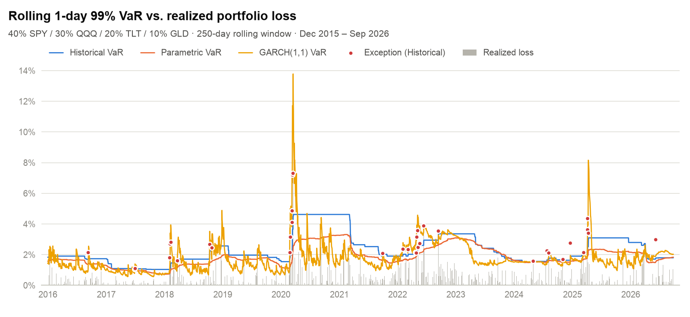
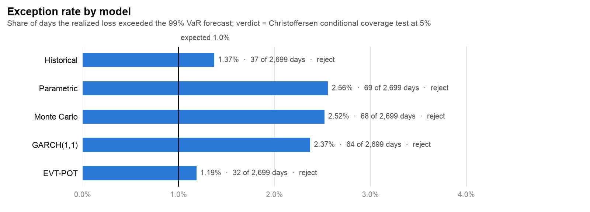
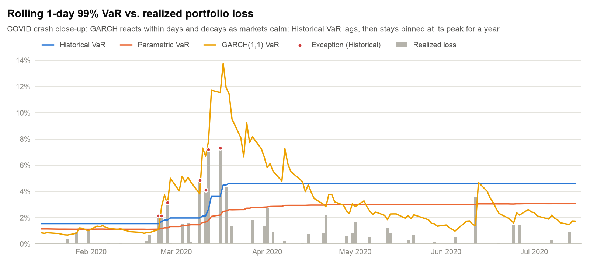
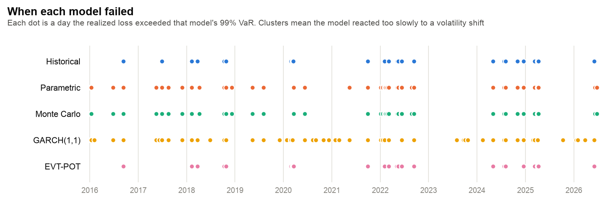
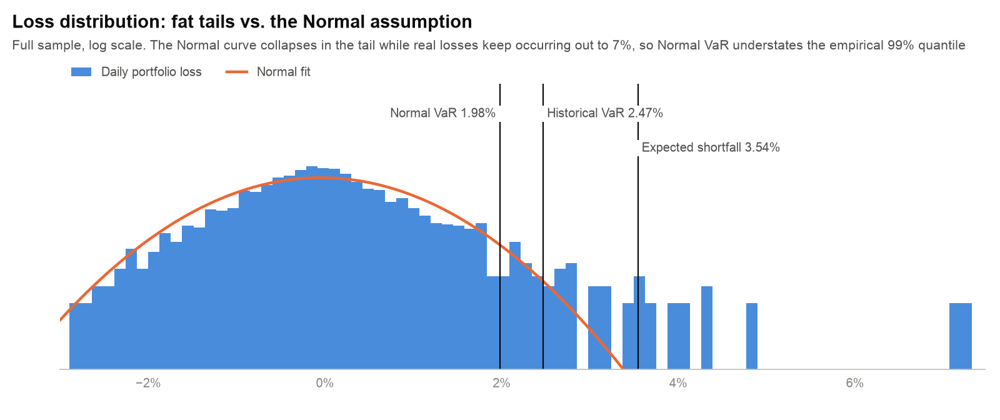

# VaR Risk Modeling & Backtesting Engine


Five Value-at-Risk models, forecast out-of-sample every trading day for a decade, then put on trial with the same statistical backtests banks use to validate their risk engines.

<picture>
  <source media="(prefers-color-scheme: dark)" srcset="assets/var_backtest_dark.png">
  
</picture>

## Key findings

Portfolio: 40% SPY / 30% QQQ / 20% TLT / 10% GLD · 99% one-day VaR · 250-day rolling window · 2,699 forecast days (Dec 2015 – Sep 2026)

- **Normal-based models breach 2.5× too often.** Parametric and Monte Carlo VaR (both assume Gaussian returns) were exceeded on ~2.5% of days against an expected 1%. Fat tails are the whole story.
- **Extreme Value Theory gets the frequency right.** EVT-POT fits a Generalized Pareto tail directly and lands at a 1.19% exception rate, the only model with a comfortable Kupiec pass (p = 0.35).
- **GARCH is the only model whose failures aren't clustered.** It re-prices risk within days of a volatility shock (independence p = 0.70), but its Normal innovations still make the tail too thin.
- **No single model passes conditional coverage.** Getting both the *rate* and the *timing* of failures right needs both ideas at once, which points to GARCH with fat-tailed innovations or filtered historical simulation as the next step.

## Backtest scorecard

| Model | Exceptions | Hit rate | Kupiec POF p | Independence p | Cond. coverage p | Verdict (5%) |
|---|---:|---:|---:|---:|---:|---|
| Historical | 37 | 1.37% | 0.067 | 0.001 | 0.001 | Reject |
| Parametric Normal | 69 | 2.56% | <0.001 | 0.009 | <0.001 | Reject |
| Monte Carlo | 68 | 2.52% | <0.001 | 0.008 | <0.001 | Reject |
| GARCH(1,1) | 64 | 2.37% | <0.001 | **0.702** | <0.001 | Reject |
| EVT-POT | 32 | 1.19% | **0.346** | <0.001 | 0.001 | Reject |

Expected at 99%: 1.00% (≈27 exceptions). Kupiec tests *how often* the model fails, Christoffersen independence tests whether failures *cluster*, and conditional coverage tests both jointly. Reproduce with `python make_figures.py`. Full results are in [`assets/backtest_results.csv`](assets/backtest_results.csv).

<picture>
  <source media="(prefers-color-scheme: dark)" srcset="assets/exception_rate_dark.png">
  
</picture>

## Models

| Model | Idea | Implementation |
|---|---|---|
| **Historical** | Empirical 1% quantile of the last 250 returns. No distributional assumption | `var_historical` |
| **Parametric Normal** | −(μ + z·σ) from the rolling mean and standard deviation | `var_parametric_normal` |
| **Monte Carlo** | 25,000 draws from a multivariate Normal with the window's mean vector and covariance matrix | `var_monte_carlo_portfolio` |
| **GARCH(1,1)** | One-step-ahead conditional volatility, so risk rises and decays with volatility clustering | `var_garch` |
| **EVT-POT** | Generalized Pareto fit to losses above the 95th percentile, inverted at 99% | `var_evt_pot` |
| **Expected Shortfall** | Average loss on days beyond VaR, i.e. how bad the bad days are | `cvar_historical` |

Every forecast for day *t* is estimated only from returns through *t − 1*, so there is no look-ahead bias.

## Where the models break

### Reaction speed: the COVID crash

<picture>
  <source media="(prefers-color-scheme: dark)" srcset="assets/var_backtest_covid_dark.png">
  
</picture>

GARCH jumped from ~1% to over 11% within three weeks, then decayed as markets calmed. Historical VaR only moved once the crash days entered its window, and then stayed pinned at 4.6% until those days rolled out a year later. That's too slow on the way up and too conservative on the way down.

### Clustering: when each model failed

<picture>
  <source media="(prefers-color-scheme: dark)" srcset="assets/exception_timeline_dark.png">
  
</picture>

The rolling-window models fail in bursts (early 2018, March 2020, the 2022 rate shock, April 2025), which is exactly what the independence test flags. GARCH's failures are spread evenly through time, and there are simply too many of them.

### Fat tails: why Normal VaR is too low

<picture>
  <source media="(prefers-color-scheme: dark)" srcset="assets/loss_distribution_dark.png">
  
</picture>

On a log scale the Normal curve collapses past ~3%, but the portfolio kept producing losses out to 7%. Over the full sample the Normal 99% VaR is 1.98%, versus an empirical 2.47%, and the average loss beyond that threshold (expected shortfall) is 3.54%.

## Interactive dashboard

```bash
streamlit run dashboard.py
```

Choose any tickers and weights, a confidence level (90/95/99%) and a window length. The dashboard runs Historical, Parametric, GARCH and EVT-POT side by side, with VaR charts, an exception timeline, a monthly exception heatmap, the full Kupiec/Christoffersen table and a GPD tail-fit diagnostic.

> For speed, the dashboard fits GARCH once on the full sample and filters conditional volatility through it, so it's for exploration. The scorecard above re-fits GARCH on each rolling window.

## Getting started

```bash
git clone https://github.com/LukasUNCW/VaR-Risk-Modeling-Backtesting-Engine.git
cd VaR-Risk-Modeling-Backtesting-Engine
pip install -r requirements.txt
```

| Command | What it does |
|---|---|
| `python run_single_asset.py` | Historical and Parametric VaR backtest on SPY |
| `python run_port.py` | Historical, Parametric and Monte Carlo VaR backtest on the four-asset portfolio (edit the ticker and weight lists at the top) |
| `python make_figures.py` | Full five-model backtest; regenerates every chart and the scorecard in `assets/` (~1 min) |
| `streamlit run dashboard.py` | Interactive dashboard |

Market data comes from Yahoo Finance via `yfinance` (adjusted closes, log returns).
